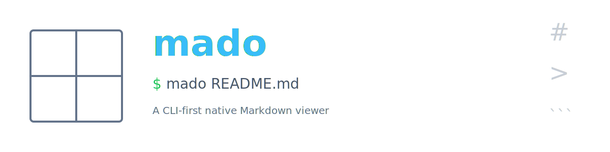

<p align="center">
  
</p>

<p align="center">
  <a href="./README.md">English</a>
</p>

# mado

> ターミナルから一発で開く、macOS ネイティブの Markdown ビューワー。

<!-- TODO: スクリーンショット -->

## 特長

- **GFM 完全対応** — `marked` + `marked-gfm-heading-id` による GitHub Flavored Markdown
- **Mermaid v11** — ダイアグラムをネイティブに描画
- **シンタックスハイライト** — `highlight.js` 使用
- **GitHub 互換スタイル** — `github-markdown-css` 使用
- **Hot Reload** — `fs.watch` + WebSocket + スクロール位置保持
- **CLI ランチャー** — `mado README.md` でネイティブウィンドウを即起動
- **ファイル履歴サイドバー** — 最近開いたファイルへの即アクセス
- **構造化ログ** — ローカル TZ の ISO 8601 タイムスタンプ付き 1 行 1 イベント

## インストール

Homebrew Cask 経由でインストールします (macOS Apple Silicon)。

```bash
brew install --cask hummer98/mado/mado
```

`/Applications/mado.app` と `$(brew --prefix)/bin/mado` (CLI) が配置されます。

既存のインストールを更新する場合:

```bash
brew update && brew upgrade --cask mado
```

新バージョンがリリースされると GitHub Actions が Cask を自動更新します。

> 現時点で mado は署名されていません。macOS Gatekeeper が初回起動を弾く場合は以下を実行してください:
> `xattr -dr com.apple.quarantine /Applications/mado.app`

ソースからビルドする場合は下記の [Development](#development) セクションを参照してください。

### 手動インストール (Homebrew を使わない場合)

[Releases](https://github.com/hummer98/mado/releases) から `mado-v*-macos-arm64.zip` をダウンロードし、`mado.app` を `/Applications` に配置した上で、`MADO_FILE` 環境変数を設定して `/Applications/mado.app/Contents/MacOS/launcher` を `exec` するシェルラッパーを `PATH` に通してください ([`bin/mado`](./bin/mado) が参考になります)。

## 使い方

```bash
mado README.md           # ローカルファイルを開く
mado docs/seed.md        # 相対パスは cwd 基準で解決
mado https://...         # URL を開く(将来対応)
```

ファイルの変更は自動検知され、スクロール位置を保ったまま再描画されます。

## 仕組み

mado は [Electrobun](https://electrobun.dev) — [Bun](https://bun.sh) と macOS ネイティブ WKWebView を組み合わせた軽量フレームワーク — の上に構築されています。Bun プロセスが CLI 引数をパースし、ファイルを watch し、WebSocket 経由で WebView に更新を push します。WebView 側では `marked` + `mermaid` が Markdown を描画します。

プロダクト全体のコンセプトとアーキテクチャは [docs/seed.md](./docs/seed.md) を参照してください。

## 開発

前提: macOS (arm64)、[Bun](https://bun.sh) 1.0 以上。

```bash
bun install              # 依存インストール
bun start                # dev 起動
bun test                 # ユニットテスト
bun test:rendering       # Playwright によるレンダリングテスト
bun test:e2e             # Electrobun 統合テスト
```

## ライセンス

MIT — [LICENSE](./LICENSE) を参照。

## コントリビューション

Issue ベースのコントリビューションを歓迎します。大きな変更の前にはスコープ相談のため Issue を立ててください。軽微な修正は直接 PR で構いません。
