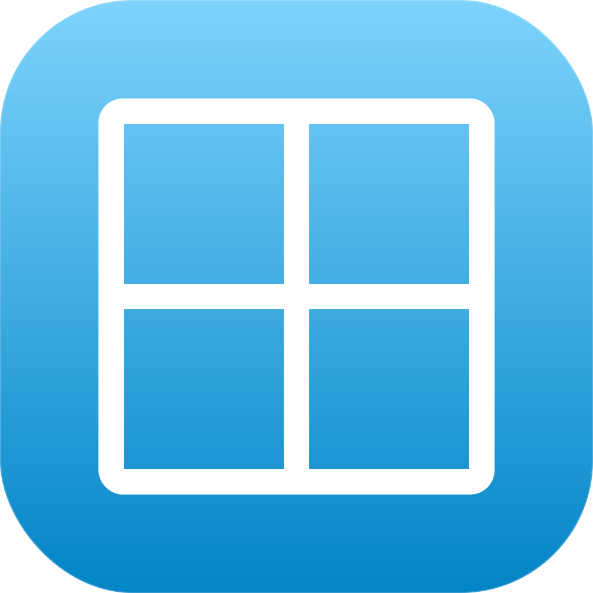

<p align="center">
  
</p>

<p align="center">
  <a href="./README.md">English</a>
</p>

# mado

> ターミナルから一発で開く、macOS ネイティブの Markdown ビューワー。

<!-- TODO: スクリーンショット -->

## なぜ作ったか

Markdown エディターは数あれど、AI エージェントとコーディングしていると Markdown 自体を編集する場面はほとんどありません。エディター機能は単に邪魔なのです。かといって VSCode でプレビューを開くのは手間がかかりすぎる。

ブラウザベースのビューワー（localhost 起動型）はいくつもありますが、普段遣いのタブと混ざってしまいます。URL スキームで `open` しても、どのウィンドウ・プロファイルで開くかを制御できません。

GFM と Mermaid v11 をきちんと表示できるビューワーも少なかった。

欲しかったのはシンプルで、「ターミナルから起動できるネイティブウィンドウ」。プロジェクトごとに専用ウィンドウを持ち、作業中はそこに留まる。それだけです。

## 特長

- **GFM 完全対応** — `marked` + `marked-gfm-heading-id` による GitHub Flavored Markdown
- **Mermaid v11** — ダイアグラムをネイティブに描画
- **シンタックスハイライト** — `highlight.js` 使用
- **GitHub 互換スタイル** — `github-markdown-css` 使用
- **Hot Reload** — `fs.watch` + WebSocket + スクロール位置保持
- **CLI ランチャー** — `mado README.md` でネイティブウィンドウを即起動
- **ファイル履歴サイドバー** — 最近開いたファイルへの即アクセス
- **構造化ログ** — ローカル TZ の ISO 8601 タイムスタンプ付き 1 行 1 イベント

## インストール

Homebrew Cask 経由でインストールします (macOS Apple Silicon)。

```bash
brew install --cask hummer98/mado/mado
```

`/Applications/mado.app` と `$(brew --prefix)/bin/mado` (CLI) が配置されます。

既存のインストールを更新する場合:

```bash
brew update && brew upgrade --cask mado
```

新バージョンがリリースされると GitHub Actions が Cask を自動更新します。

mado は Apple Developer ID で署名・公証済みのため、macOS でそのまま起動できます (追加の回避操作は不要です)。

ソースからビルドする場合は下記の [Development](#development) セクションを参照してください。

### 手動インストール (Homebrew を使わない場合)

[Releases](https://github.com/hummer98/mado/releases) から `mado-v*-macos-arm64.zip` をダウンロードし、`mado.app` を `/Applications` に配置した上で、`MADO_FILE` 環境変数を設定して `/Applications/mado.app/Contents/MacOS/launcher` を `exec` するシェルラッパーを `PATH` に通してください ([`bin/mado`](./bin/mado) が参考になります)。

### `.md` のデフォルトアプリを mado にする

mado は Info.plist で Markdown ハンドラとして自己宣言しているので、
`/Applications` にインストールしてあれば `duti` を入れなくても Finder の標準
フローでデフォルトアプリに設定できます。

1. Finder で `.md` ファイルを右クリック →「**情報を見る**」を開く。
2. 「**このアプリケーションで開く**」プルダウンを展開し、`mado` を選ぶ
   （mado は `LSHandlerRank=Alternate` で登録されているため、「その他の
   アプリケーション」グループに表示されることがあります）。
3. 「**すべてを変更...**」をクリックすると確認ダイアログ
   （「類似の書類すべてに適用しますか？」）が出るので、**続ける** を選ぶと
   すべての `.md` ファイルのデフォルトが mado に切り替わります。

インストール直後にプルダウンへ出てこない場合は、LaunchServices DB を
リフレッシュしてください:

```bash
/System/Library/Frameworks/CoreServices.framework/Versions/A/Frameworks/LaunchServices.framework/Versions/A/Support/lsregister -f /Applications/mado.app
```

mado は `Default` ではなく `Alternate` で登録しているため、既に設定している
主 Markdown エディタ (Typora / Obsidian / VS Code など) を勝手に奪うことは
ありません。「すべてを変更...」を明示的に押した時だけ、mado がデフォルトに
昇格します。

## 使い方

```bash
mado README.md           # ローカルファイルを開く
mado docs/seed.md        # 相対パスは cwd 基準で解決
mado https://...         # URL を開く(将来対応)
```

ファイルの変更は自動検知され、スクロール位置を保ったまま再描画されます。

起動後はシェルが即解放され、Ctrl+C や端末を閉じても mado は生き残ります。
デバッグ目的で前景動作させたい場合は `MADO_FOREGROUND=1 mado ...` を使ってください。

## 仕組み

mado は [Electrobun](https://electrobun.dev) — [Bun](https://bun.sh) と macOS ネイティブ WKWebView を組み合わせた軽量フレームワーク — の上に構築されています。Bun プロセスが CLI 引数をパースし、ファイルを watch し、WebSocket 経由で WebView に更新を push します。WebView 側では `marked` + `mermaid` が Markdown を描画します。


## 開発

前提: macOS (arm64)、[Bun](https://bun.sh) 1.0 以上。

```bash
bun install              # 依存インストール
bun start                # dev 起動
bun test                 # ユニットテスト
bun test:rendering       # Playwright によるレンダリングテスト
bun test:e2e             # Electrobun 統合テスト
```

## ライセンス

MIT — [LICENSE](./LICENSE) を参照。

## コントリビューション

Issue ベースのコントリビューションを歓迎します。大きな変更の前にはスコープ相談のため Issue を立ててください。軽微な修正は直接 PR で構いません。
