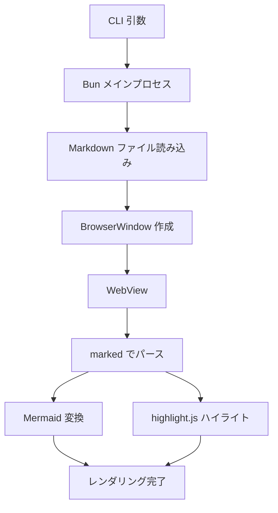

# mado

CLI-first Markdown viewer built with Electrobun (Bun + WKWebView).

## 使い方

```bash
mado README.md          # ネイティブウィンドウで開く（Hot Reload 付き）
mado https://...        # URL を開く
mado render file.md     # PNG を出力（AI 向け画像変換）
```

## 機能

- **GFM (GitHub Flavored Markdown)** 対応
- **Mermaid ダイアグラム** 対応
- **シンタックスハイライト** (highlight.js)
- **Hot Reload** — ファイル変更を自動反映

## テーブル

| 機能 | ステータス |
|------|----------|
| GFM レンダリング | ✅ Phase 1 |
| Mermaid | ✅ Phase 1 |
| Hot Reload | 🔧 Phase 2 |
| CLI 統合 | 🔧 Phase 2 |

## タスクリスト

- [x] Electrobun プロジェクト初期化
- [x] ログ基盤の実装
- [x] Markdown レンダリング
- [ ] Hot Reload
- [ ] CLI 統合

## コードブロック

```typescript
import { BrowserWindow } from "electrobun/bun";

const win = new BrowserWindow({
  title: "mado",
  frame: { width: 900, height: 700, x: 0, y: 0 },
  url: "views://mainview/index.html",
});
```

## Mermaid ダイアグラム


