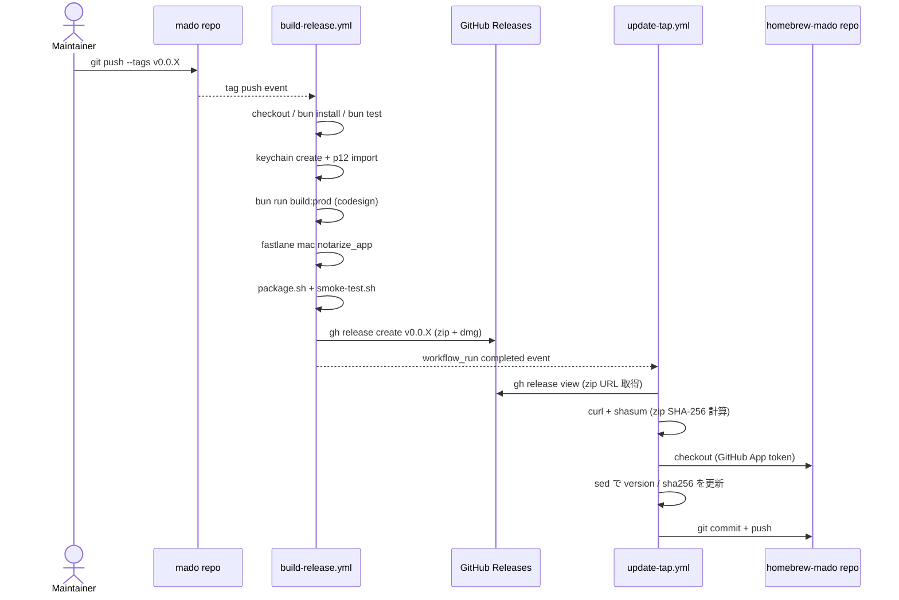
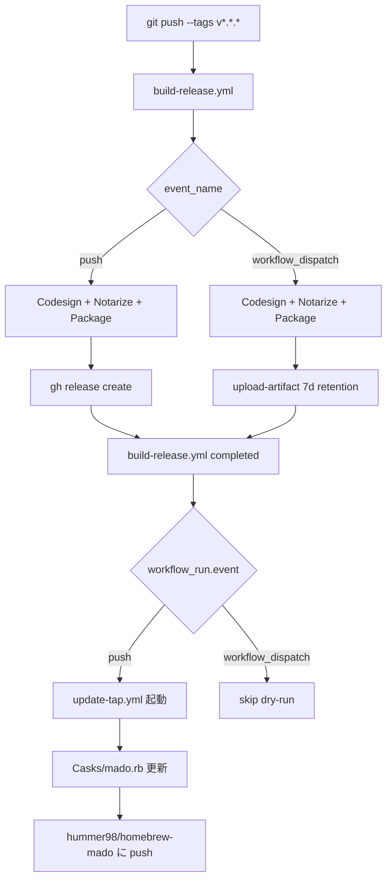

# Release Automation — 署名・公証 + Homebrew Cask 自動更新

mado のリリースは「ローカル: tag push」→「CI A: ビルド + 署名 + 公証 + Release 作成」→「CI B: Homebrew Cask 自動更新」の 3 段で完結する。本ドキュメントはこの 2 本立て workflow の運用情報をまとめる。

- **想定読者**: mado メンテナー（リリース実行者・Secret 管理者）
- **前提**: ローカル署名・公証のセットアップは [`docs/signing-setup.md`](signing-setup.md) で完了済み

## 1. 構成概要

### 1.1 2 本立て workflow の役割

| Workflow | ファイル | トリガー | 役割 |
|---|---|---|---|
| **A. Build & Release** | [`.github/workflows/build-release.yml`](../.github/workflows/build-release.yml) | `push` tags `v*.*.*` / `workflow_dispatch` | macos-14 runner で codesign → notarize → zip/dmg 生成 → GitHub Release 作成 |
| **B. Update Homebrew Cask** | [`.github/workflows/update-tap.yml`](../.github/workflows/update-tap.yml) | `workflow_run`（Build & Release 完了） / `workflow_dispatch` | build-release.yml の完了を検知して `hummer98/homebrew-mado` の `Casks/mado.rb` を自動更新 |

2 本立てにしている理由:

1. **runner 時間の使い分け**: 重い build（〜30 分）と軽い cask 書き換え（数十秒）を独立した workflow にすると、cask 更新だけを再実行したいときに build を走らせずに済む
2. **権限の分離**: build 側は自リポジトリへの release 作成（`contents: write`）で済むが、cask 側は別リポジトリ（`hummer98/homebrew-mado`）への push が必要なので、別途 `HOMEBREW_TAP_TOKEN` (PAT) を使う
3. **独立リトライ**: 片方だけ失敗した場合（例: notarize は成功したが Apple CDN 反映待ちで cask 更新がコケた等）に独立してリトライできる

### 1.2 起動シーケンス



### 1.3 全体フロー



## 2. Workflow A: build-release.yml（署名・公証・Release 作成）

### 2.1 トリガーと dry-run

| イベント | 挙動 |
|---|---|
| `push` (tag `v*.*.*`) | 本番 release を作成。既存 release があれば `gh release upload --clobber` で asset を上書き（CI 二重起動 / retry の冪等性確保） |
| `workflow_dispatch` | release は作らず `actions/upload-artifact@v4` で zip/dmg を 7 日保持（dry-run） |

- `concurrency.group=build-release-${{ github.ref }}`、`cancel-in-progress: false`（中途半端な release を残さない）
- `permissions: contents: write`
- runner: `macos-14` / `timeout-minutes: 45`

### 2.2 ステップ概要

1. `actions/checkout@v4`
2. `oven-sh/setup-bun@v2`（`bun-version: latest`）
3. **VERSION 解決**: `push` 時は tag から、`workflow_dispatch` 時は `package.json` から
4. `ruby/setup-ruby@v1`（`3.3`、`bundler-cache: false`）
5. fastlane 利用可能性チェック（無ければ `gem install fastlane --no-document`）
6. **一時 keychain の作成 & .p12 import**（[§2.3](#23-一時-keychain-構築の要点) の順序を厳守）
7. `bun install --frozen-lockfile`
8. `bun test`
9. `bun run build:prod`（Electrobun が helper / launcher / framework / dmg まで deep に codesign）
10. `fastlane mac notarize_app`（`timeout-minutes: 25`）
11. `bash scripts/package.sh <version>` で zip/dmg を `dist/` に生成
12. `bash scripts/smoke-test.sh`（`spctl --assess` で Notarized 検出 → `codesign --verify --deep --strict` → `stapler validate` → 起動ログ確認）
13. **push 時のみ**: `gh release create` または `gh release upload --clobber`
14. **dispatch 時のみ**: `actions/upload-artifact@v4`（`retention-days: 7`、`if-no-files-found: error`）
15. **`if: always()`**: 一時 keychain を削除し、default-keychain を `~/Library/Keychains/login.keychain-db` に戻す

### 2.3 一時 keychain 構築の要点

CI 環境で codesign が UI prompt を出さずに動くためには、以下の順序を厳守する必要がある:

1. `security create-keychain -p "$KEYCHAIN_PASSWORD" "$KEYCHAIN_PATH"`
2. `security set-keychain-settings -lut 21600`（6 時間後にロック）
3. `security unlock-keychain`
4. `security list-keychains -d user -s` で **既存 search-list を保ったまま追加**（runner 既定 keychain を壊さない）
5. `security default-keychain -s` で default に昇格
6. `security import` で `.p12` を取り込み
7. `security set-key-partition-list -S apple-tool:,apple:,codesign:`（**漏れると codesign が UI prompt で hang する**）

`.p12` の base64 復号は `RUNNER_TEMP` 配下で行い、import 直後に `rm -f` で削除する（防御層深め）。`Cleanup keychain` step は `if: always()` なので、途中失敗時にも keychain は確実に削除される。

### 2.4 使用 Secrets

7 個 + GitHub 自動付与の `GITHUB_TOKEN`:

- `KEYCHAIN_PASSWORD` / `DEVELOPER_ID_P12_BASE64` / `DEVELOPER_ID_P12_PASSWORD` / `ELECTROBUN_DEVELOPER_ID`
- `APP_STORE_CONNECT_API_KEY_KEY_ID` / `APP_STORE_CONNECT_API_KEY_ISSUER_ID` / `APP_STORE_CONNECT_API_KEY_KEY`
- `GITHUB_TOKEN`（Release 作成のみ）

詳細は [§4 GitHub Secrets 一覧](#4-github-secrets-一覧) を参照。

## 3. Workflow B: update-tap.yml（Homebrew Cask 自動更新）

> 旧 `.github/workflows/release.yml` を T035 で `update-tap.yml` にリネーム（コミット `f570cdb`）。役割（Cask 自動更新）は変わっていない。

### 3.1 トリガーとガード

| イベント | 挙動 |
|---|---|
| `workflow_run` (`Build & Release (codesign + notarize)` 完了) | `workflow_run.conclusion == 'success' && workflow_run.event == 'push'` の場合のみ発火（成功した tag push ビルドのみ。dry-run = workflow_dispatch 由来は除外） |
| `workflow_dispatch` (`inputs.tag` 必須) | ガードを通さず常に許可。過去 tag を指定した手動再実行に使う |

- `concurrency.group=update-homebrew-cask`、`cancel-in-progress: false`
- `permissions: contents: read`（自リポジトリは読むだけ。tap への push は `HOMEBREW_TAP_TOKEN` で別経路）
- runner: `macos-latest`

### 3.2 ステップ概要

1. tag/version 解決（`workflow_run.head_branch` または `inputs.tag`）。`build-release.yml` は `on: push: tags: ['v*.*.*']` でしか push 起動しないため、`if:` で `event == 'push'` を通った時点で `head_branch` には tag 名（例: `v0.3.0`）が入っている
2. `gh release view` で `*-macos-arm64.zip` の URL を取得
3. `curl -fL --retry 3 --retry-delay 5` で zip を取得 → `shasum -a 256` で SHA-256 計算
4. `actions/checkout@v4` で `hummer98/homebrew-mado` を `tap/` 配下に clone（`HOMEBREW_TAP_TOKEN` を `token:` に渡す）
5. `sed -i ''` で `Casks/mado.rb` の `version` 行と `sha256` 行を置換（`url` 行は `v#{version}` 補間のため不変）
6. **検証**: `version "X.Y.Z"` / `sha256 "..."` / `vX.Y.Z` の 3 つが反映されているか `grep -q` で確認（失敗なら `::error::` で exit 1）
7. `git config` → `git add` → 差分なしなら `No changes (already up-to-date)` で exit 0、差分があれば `git commit -m "chore: bump mado to v$VERSION"` → `git push`

### 3.3 使用 Secrets

- `HOMEBREW_TAP_TOKEN`（tap repo への push）
- `GITHUB_TOKEN`（自リポジトリの release 参照のみ。GitHub 自動付与）

詳細は [§4 GitHub Secrets 一覧](#4-github-secrets-一覧) を参照。

## 4. GitHub Secrets 一覧

### 4.1 一覧表

[`docs/signing-setup.md` §8](signing-setup.md#8-phase-2-で実施github-secrets-の登録) と完全に整合（順序・名前・8 個ちょうど）。

| Secret | 用途 | 設定方法 | 失効予定日 |
|---|---|---|---|
| `ELECTROBUN_DEVELOPER_ID` | Electrobun が codesign 時に参照する Developer ID Application 識別子（`"Developer ID Application: Name (TEAMID)"` 文字列） | [`docs/signing-setup.md` §2](signing-setup.md#2-developer-id-application-証明書の取り込み) | 証明書失効と同時（[§5](#5-証明書api-keypat-の失効予定日)） |
| `DEVELOPER_ID_P12_BASE64` | 一時 keychain に import する `.p12` を `base64 -i` した文字列 | [`docs/signing-setup.md` §2](signing-setup.md#2-developer-id-application-証明書の取り込み) | 証明書失効と同時（[§5](#5-証明書api-keypat-の失効予定日)） |
| `DEVELOPER_ID_P12_PASSWORD` | `.p12` エクスポート時に設定したパスワード | [`docs/signing-setup.md` §2](signing-setup.md#2-developer-id-application-証明書の取り込み) | 証明書失効と同時（[§5](#5-証明書api-keypat-の失効予定日)） |
| `APP_STORE_CONNECT_API_KEY_KEY_ID` | App Store Connect API Key の Key ID（10 文字英数字） | [`docs/signing-setup.md` §3](signing-setup.md#3-app-store-connect-api-key-の発行) | 失効なし（漏洩時 revoke） |
| `APP_STORE_CONNECT_API_KEY_ISSUER_ID` | 同 Issuer ID（UUID） | [`docs/signing-setup.md` §3](signing-setup.md#3-app-store-connect-api-key-の発行) | 失効なし |
| `APP_STORE_CONNECT_API_KEY_KEY` | `.p8` の中身（PEM、改行込み）。fastlane が tempfile 化して `xcrun notarytool` に渡す | [`docs/signing-setup.md` §3](signing-setup.md#3-app-store-connect-api-key-の発行) | 失効なし（漏洩時 revoke） |
| `KEYCHAIN_PASSWORD` | CI 上で作成する一時 keychain のパスワード | `openssl rand -base64 24` で生成（[`signing-setup.md` §8](signing-setup.md#8-phase-2-で実施github-secrets-の登録)） | 任意（推奨ローテ: 1 年） |
| `HOMEBREW_TAP_TOKEN` | `hummer98/homebrew-mado` への push 用 PAT | 本ドキュメント [§6](#6-pat-homebrew_tap_token-発行手順) | 90 日（[§5](#5-証明書api-keypat-の失効予定日)） |

`build-release.yml` で 7 個（`HOMEBREW_TAP_TOKEN` 以外）+ `GITHUB_TOKEN`、`update-tap.yml` で `HOMEBREW_TAP_TOKEN` + `GITHUB_TOKEN` を参照。

### 4.2 登録手順

1. `https://github.com/hummer98/mado/settings/secrets/actions` を開く
2. **New repository secret** を押下
3. **Name** に上表の Secret 名（タイポ厳禁。CI 側のステップが `secrets.<NAME>` を参照する）、**Secret** に値を貼り付ける
4. **Add secret** を押下

複数行の値（`APP_STORE_CONNECT_API_KEY_KEY` の PEM、`DEVELOPER_ID_P12_BASE64` の base64）はそのまま貼り付けて構わない。GitHub Actions の `secrets.*` 経由で env に渡せば改行は保持される（`echo` 等で再エンコードしないことが前提）。

## 5. 証明書・API Key・PAT の失効予定日

> 本セクションは「**失効予定日とリマインダー**」を扱う。失効後の復旧手順は [`docs/signing-setup.md` §7](signing-setup.md#7-失効紛失時の対応) と本ドキュメント [§6.3](#63-失効時の対応) に記載。役割が重複しないよう「予定日」と「事後対応」で分担している。

### 5.1 失効予定日表

新規発行のたびに更新する。失効予定日の **7 日前**までに再発行すること。

| 対象 | 種別 | 発行日 | 失効予定日 | 再発行手順 | メモ |
|---|---|---|---|---|---|
| Developer ID Application 証明書 | 5 年有効 | TBD | TBD（発行日 + 5 年） | [`docs/signing-setup.md` §2](signing-setup.md#2-developer-id-application-証明書の取り込み) | 失効すると `build-release.yml` の codesign / notarize step が失敗。`security find-identity` から消えるのも兆候 |
| App Store Connect API Key | 失効なし | TBD | — | [`docs/signing-setup.md` §3](signing-setup.md#3-app-store-connect-api-key-の発行) | Apple 側に有効期限はないが、漏洩疑いで revoke。ローテ目安は 1 年 |
| `HOMEBREW_TAP_TOKEN` (Fine-grained PAT) | 90 日 | TBD | TBD（発行日 + 90 日） | 本ドキュメント [§6](#6-pat-homebrew_tap_token-発行手順) | 失効すると `update-tap.yml` の `Checkout tap repo` または `Commit & push` step が 401/403 で失敗 |
| `KEYCHAIN_PASSWORD` | 任意 | TBD | TBD（推奨ローテ 1 年） | `openssl rand -base64 24` を再生成し Secret 上書き | 漏洩リスクは低いが定期ローテ推奨 |

「TBD」は初回登録時に運用者が `YYYY-MM-DD` 形式で埋める。

### 5.2 リマインダー設定例（任意）

失効予定日の 7 日前に通知されるよう、以下のいずれかを運用者が選んで設定する:

- **macOS Calendar**:

  ```bash
  osascript -e 'tell application "Calendar" to make new event at calendar "Home" with properties {summary:"mado HOMEBREW_TAP_TOKEN 失効 7 日前", start date:date "YYYY/MM/DD HH:MM"}'
  ```

- **GitHub Issue 自動生成**: 失効予定日の 7 日前に警告 issue を自動生成する cron workflow を追加する
- **macOS `reminders` CLI / その他**: 運用者好みのツールでリマインダー登録する

## 6. PAT (HOMEBREW_TAP_TOKEN) 発行手順

### 6.1 推奨: Fine-grained PAT

1. GitHub Settings → Developer settings → Personal access tokens → Fine-grained tokens
2. **Generate new token** を押下
3. 以下を設定:
   - **Token name**: `mado-homebrew-tap-updater`
   - **Resource owner**: `hummer98`
   - **Expiration**: 90 日（必須）
   - **Repository access**: Only select repositories → `hummer98/homebrew-mado`
   - **Permissions** (Repository):
     - `Contents`: Read and write
     - `Metadata`: Read-only（自動付与）
4. **Generate token** を押下してトークン文字列をコピー
5. mado 本体で Secret `HOMEBREW_TAP_TOKEN` に登録（[§4.2](#42-登録手順)）
6. [§5.1 失効予定日表](#51-失効予定日表) の発行日 / 失効予定日を更新

### 6.2 代替: Classic PAT

1. GitHub Settings → Developer settings → Personal access tokens → Tokens (classic)
2. **Generate new token (classic)** を押下
3. 以下を設定:
   - **Note**: `mado-homebrew-tap-updater`
   - **Expiration**: 90 日
   - **Scope**: `repo`（`repo:status`, `public_repo` だけだと足りないケースがあるため `repo` 推奨）
4. **Generate token** を押下してトークン文字列をコピー
5. 以降は §6.1 の 5〜6 と同じ

### 6.3 失効時の対応

1. release 時に `update-tap.yml` の `Checkout tap repo` または `Commit & push` step が 401/403 で失敗 → Actions ページのメール通知で検知
2. 新しい PAT を §6.1 / §6.2 に従い再発行
3. mado 本体の Secret `HOMEBREW_TAP_TOKEN` を新 PAT で上書き
4. Actions の失敗した run を **Re-run jobs** で再実行するか、`workflow_dispatch` で対象 tag を指定して手動リラン
5. 本ドキュメント [§5.1 失効予定日表](#51-失効予定日表) を更新

## 7. 手動フォールバック（Actions が使えない場合）

GitHub Actions 全体が利用不可、または `build-release.yml` が連続失敗するなどで CI に頼れない場合、メンテナーがローカル機で「ビルド → 署名 → 公証 → Release 作成 → Cask 更新」をフルパスで実行する。

**前提**: ローカル direnv で 4 つの env が揃っていること（[`docs/signing-setup.md` §4](signing-setup.md#4-ローカル環境の-direnv-設定)）。

- `mado/.envrc`: `ELECTROBUN_DEVELOPER_ID`
- `~/git/.envrc`（親）: `APP_STORE_CONNECT_API_KEY_KEY_ID` / `APP_STORE_CONNECT_API_KEY_ISSUER_ID` / `APP_STORE_CONNECT_API_KEY_KEY`

### 7.1 全体フロー

1. ローカル build & 署名（[§7.2](#72-ローカル-build-と署名)）
2. 公証（[§7.3](#73-公証)）
3. 検証とパッケージ（[§7.4](#74-検証とパッケージ)）
4. GitHub Release の手動作成（[§7.5](#75-github-release-の手動作成)）
5. tap リポジトリの手動更新（[§7.6](#76-tap-リポジトリの手動更新)）

### 7.2 ローカル build と署名

```bash
TAG=v0.0.X
VERSION="${TAG#v}"

# Electrobun が helper / launcher / framework / dmg まで deep に codesign
bun install --frozen-lockfile
bun test
bun run build:prod
APP_PATH="build/stable-macos-arm64/mado.app"
```

詳細手順と前提セットアップは [`docs/signing-setup.md` §5](signing-setup.md#5-ローカル署名公証の動作確認) を参照。

### 7.3 公証

```bash
fastlane mac notarize_app
```

5〜15 分かかる。Apple Notary Service が混雑している場合は `xcrun notarytool log <uuid>` でログを確認。

### 7.4 検証とパッケージ

```bash
codesign --verify --deep --strict --verbose=2 "$APP_PATH"
spctl --assess --type execute --verbose=2 "$APP_PATH"
stapler validate "$APP_PATH"
bash scripts/smoke-test.sh "$APP_PATH"

# zip / dmg を dist/ に生成
bash scripts/package.sh "$VERSION"
ls dist/
# → dist/mado-v${VERSION}-macos-arm64.zip
# → dist/mado-v${VERSION}-macos-arm64.dmg
```

`spctl --assess` の出力に **`accepted source=Notarized Developer ID`** と出れば公証まで OK。

### 7.5 GitHub Release の手動作成

```bash
# 既存 release が無い場合
gh release create "$TAG" \
  --title "$TAG" \
  --notes "Manual release for $TAG (Actions unavailable)." \
  --verify-tag \
  "dist/mado-v${VERSION}-macos-arm64.zip" \
  "dist/mado-v${VERSION}-macos-arm64.dmg"

# 既存 release があれば asset だけ差し替え（CI と同じ挙動）
gh release upload "$TAG" \
  "dist/mado-v${VERSION}-macos-arm64.zip" \
  "dist/mado-v${VERSION}-macos-arm64.dmg" \
  --clobber
```

### 7.6 tap リポジトリの手動更新

```bash
SHA256=$(shasum -a 256 "dist/mado-v${VERSION}-macos-arm64.zip" | awk '{print $1}')

gh repo clone hummer98/homebrew-mado /tmp/homebrew-mado
cd /tmp/homebrew-mado

sed -i '' -E "s/^(  version )\"[^\"]+\"/\1\"$VERSION\"/" Casks/mado.rb
sed -i '' -E "s/^(  sha256 )\"[0-9a-f]{64}\"/\1\"$SHA256\"/" Casks/mado.rb

# 差分確認してコミット & push
git diff Casks/mado.rb
git add Casks/mado.rb
git commit -m "chore: bump mado to v$VERSION"
git push
```

## 8. ドライラン（workflow_dispatch）

### 8.1 build-release.yml（artifact 確認）

本番 release を汚さず署名・公証パイプラインの正常性を確認したい場合:

1. `https://github.com/hummer98/mado/actions/workflows/build-release.yml` を開く
2. **Run workflow** を押下（branch は通常 `main`）
3. 実行ログで notarize / smoke-test の成功を確認
4. **Artifacts** セクションから `mado-v<VERSION>-macos-arm64` をダウンロード（`retention-days: 7`）
5. ローカルで展開して `spctl --assess --type execute --verbose=2 mado.app` を実行し、`accepted source=Notarized Developer ID` が出ることを確認

> ⚠ `workflow_dispatch` では release が作られないため、`update-tap.yml` は発火しない。Cask 更新の動作確認は §8.2 で別途行うこと。

### 8.2 update-tap.yml（過去 tag で no-op 確認）

1. `https://github.com/hummer98/mado/actions/workflows/update-tap.yml` を開く
2. **Run workflow** → `tag` 入力欄に過去のリリース tag（例: `v0.0.2`）を指定
3. 実行ログで `No changes (already up-to-date)` と出力されれば OK（同値書き換えのため `Commit & push` step でスキップされる）

## 9. 将来の改善案

- **GitHub App + installation token**: PAT ではなく GitHub App のインストールトークンで `update-tap.yml` の push を行うと、トークン失効を気にせず運用できる（scope もより狭く設定可能）
- **macOS Universal Binary 対応**: 現状 arm64 のみ build。x86_64 + arm64 の lipo を行うか、別 runner で並列ビルドして 2 種の zip/dmg を release に添付する
- **Release Notes の自動生成**: `git-cliff` / `release-please` / GitHub の自動生成機能（`gh release create --generate-notes`）を取り入れて、`--notes` の手書き部分を削減
- **prerelease 用 tap**: `prerelease == true` の release を別 tap（`hummer98/homebrew-mado-beta` 等）に流し、`brew install --cask hummer98/mado-beta/mado` で beta 配布できるようにする
- **`xcrun notarytool wait` のリトライ強化**: Apple Notary Service の長時間化に備え、fastlane の `notarize` ステップに retry / backoff を追加する

### 完了済み（履歴として残す）

- ~~codesign / notarize 対応~~ — T034 (`build-release.yml` 追加) で実装完了
- ~~`release.yml` のリネーム / 整理~~ — T035（コミット `f570cdb`、`update-tap.yml` への改名）で実装完了
