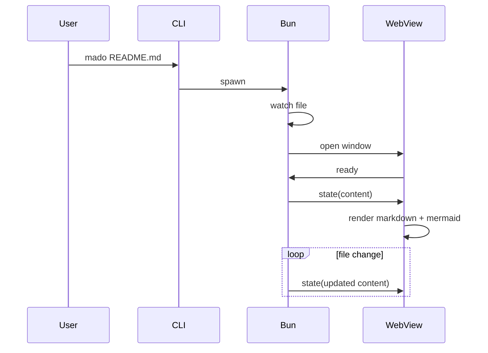
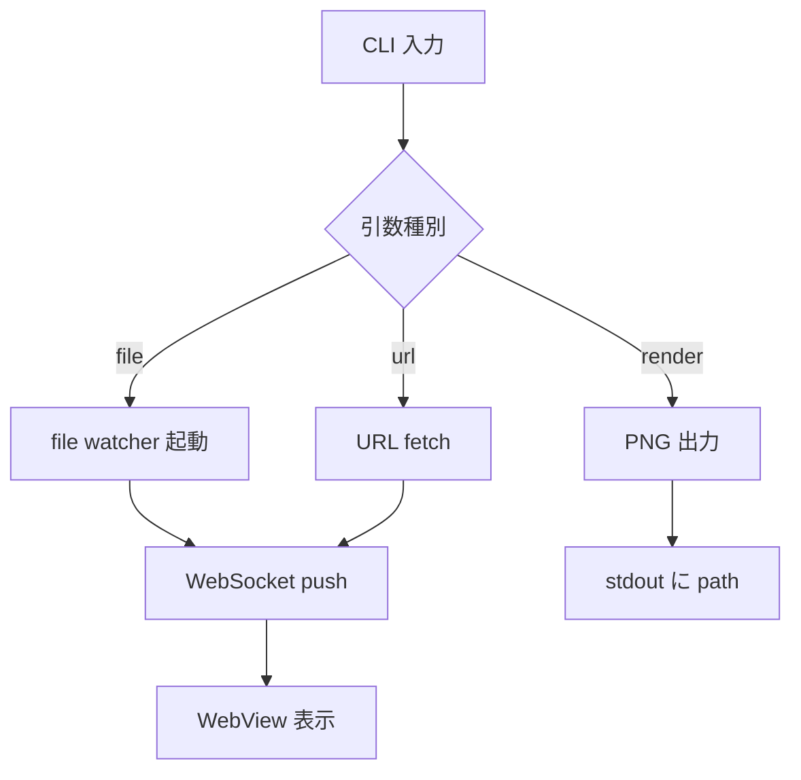
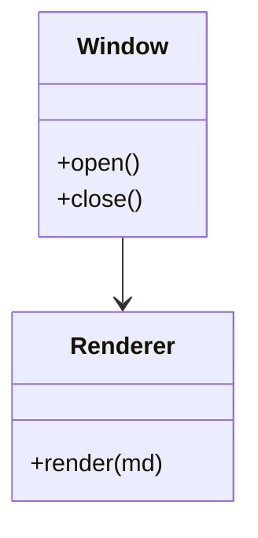

# T033 Mermaid 個別ズーム E2E 用サンプル

Mermaid を 2 個並べて、個別にズーム状態を持つことを確認する。

## 1. シーケンス図

```mermaid
sequenceDiagram
    participant User
    participant CLI
    participant Bun
    participant WebView

    User->>CLI: mado README.md
    CLI->>Bun: spawn
    Bun->>Bun: watch file
    Bun->>WebView: open window
    WebView->>Bun: ready
    Bun->>WebView: state(content)
    WebView->>WebView: render markdown + mermaid
    loop file change
        Bun->>WebView: state(updated content)
    end
```

## 2. フローチャート

```mermaid
flowchart TD
    A[CLI 入力] --> B{引数種別}
    B -->|file| C[file watcher 起動]
    B -->|url| D[URL fetch]
    B -->|render| E[PNG 出力]
    C --> F[WebSocket push]
    D --> F
    F --> G[WebView 表示]
    E --> H[stdout に path]
```

## 3. クラス図（比較用に 3 個目）

```mermaid
classDiagram
    class Window {
      +open()
      +close()
    }
    class Renderer {
      +render(md)
    }
    Window --> Renderer
```
